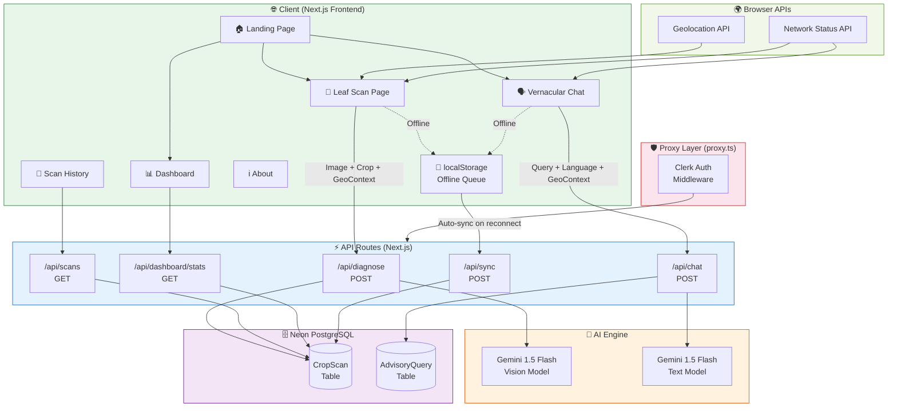
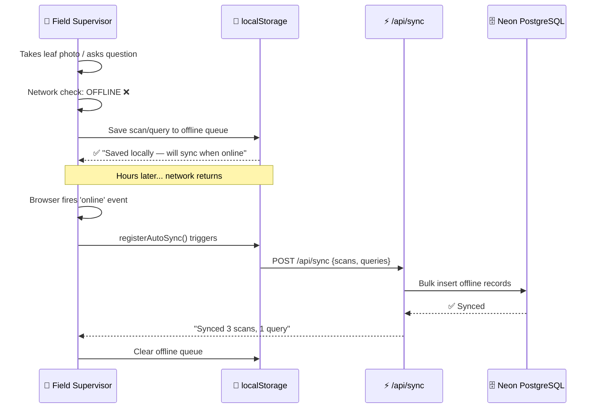
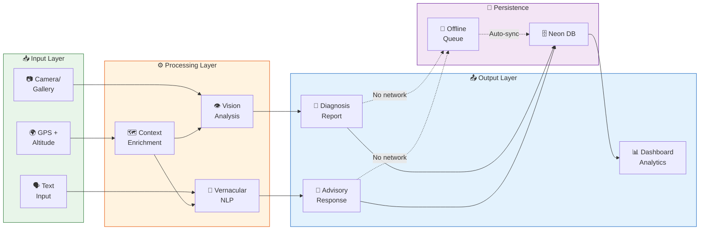
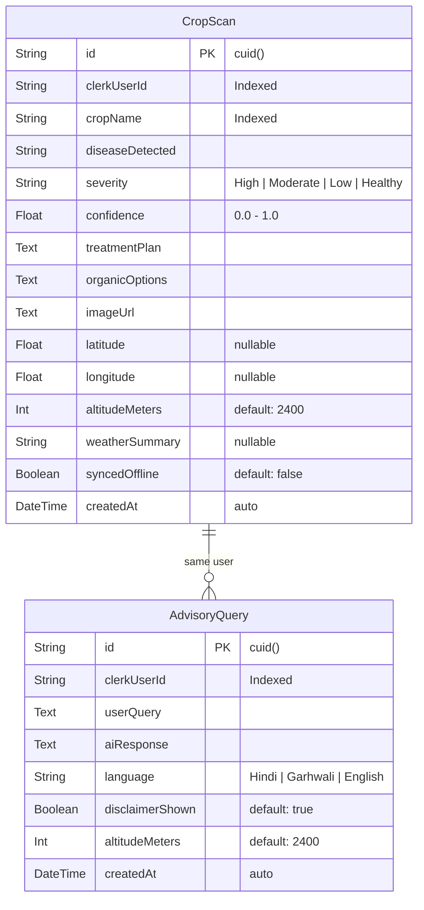
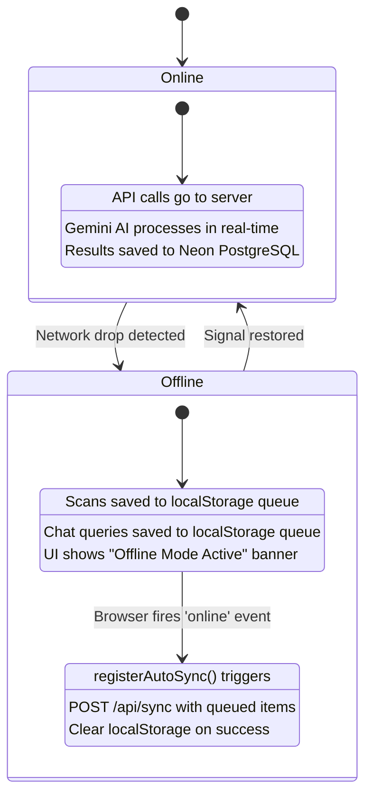
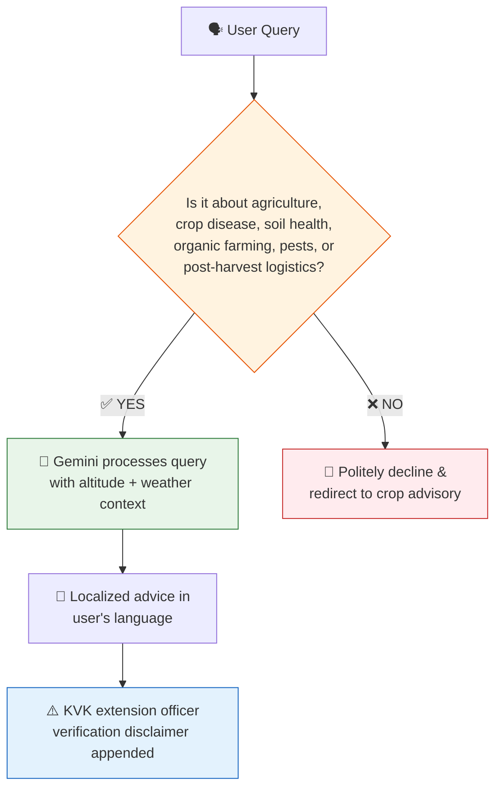

<p align="center">
  
  
  
  
  
  
  
</p>

# 🌿 AgriAssist AI

**Autonomous Multi-Modal Crop Advisory for High-Altitude Farming**

> Built for the **Mandakini Organic Produce Collective** (Kedarnath Valley, Uttarakhand — 2,400m altitude) to bridge the gap between remote grassroots MSME farming and advanced Generative AI.

*Developed during the TBI-GEU Summer Internship Program 2026.*

---

## 📋 Table of Contents

- [The Problem](#-the-problem)
- [The Solution](#-the-solution)
- [System Architecture](#-system-architecture)
- [Core Features](#-core--breakthrough-features)
- [Feature Connectivity](#-feature-connectivity--data-flow)
- [Tech Stack](#-tech-stack)
- [Project Structure](#-project-structure)
- [Database Schema](#-database-schema)
- [API Reference](#-api-reference)
- [Setup & Installation](#-setup--installation)
- [Environment Variables](#-environment-variables)
- [Screenshots & Pages](#-pages--screenshots)
- [Offline-First Architecture](#-offline-first-architecture)
- [AI Guardrails](#-ai-domain-guardrails)
- [Roadmap](#-roadmap)
- [Contributing](#-contributing)
- [License](#-license)

---

## 🎯 The Problem

Field supervisors in the Kedarnath Valley face a **triple bottleneck**:

| Challenge | Impact |
|---|---|
| 🏔️ **Remote terrain** (2,400m+) | Extension officers rarely arrive; farmers wait hours/days for advice |
| 📡 **Unstable connectivity** | 2G/3G signals drop frequently in mountain terrain |
| 🗣️ **Language barrier** | Most AI tools are English-only; farmers speak Hindi & Garhwali |

**Result:** Crop diseases go undiagnosed, post-harvest losses mount, and organic farming potential is wasted.

---

## 💡 The Solution

**AgriAssist AI** is a localized, offline-capable AI companion that delivers real-time agricultural advisory through:
- 📸 **Visual leaf scanning** with Gemini Vision AI
- 🗣️ **Vernacular chat** in Hindi, Garhwali & English
- 🌍 **Auto-injected geospatial context** (GPS, altitude, weather)
- 📡 **Offline-first sync** for mountain terrain connectivity drops

---

## 🏗️ System Architecture



---

## ✨ Core & Breakthrough Features

### 📸 Multi-Modal Vision Diagnostics
Take a photo of a diseased leaf → Gemini 1.5 Flash Vision AI analyzes visual symptoms → Returns crop name, disease identification, severity level, treatment plan, and organic mountain remedies — all context-aware to 2,400m altitude conditions.

### 🗣️ Plain-Language Vernacular Chat
Ask complex agricultural questions in **Hindi** (हिंदी), **Garhwali** (गढ़वाली), or **English**. The AI responds in the same language with practical, low-cost advice tailored for mountain farming. Quick-prompt suggestions help field supervisors ask common queries instantly.

### 🌍 Geospatial Context Ingestion
Every AI query is automatically enriched with:
- 📍 **GPS coordinates** (via browser Geolocation API)
- 🏔️ **Altitude** (default: 2,400m Kedarnath Valley)
- ☁️ **Local weather summary**

This ensures the AI's advice is specifically calibrated for the exact terrain, micro-climate, and growing conditions.

### 📡 Offline-First Sync
Mountain terrain loses connectivity frequently. AgriAssist AI handles this gracefully:



### 🛡️ Strict Domain Guardrails
Engineered system prompts constrain the LLM strictly to regional crop advisory:
- ✅ Agriculture, crop disease, soil health, organic farming, pests, post-harvest logistics
- ❌ Politics, general tech, movies, non-agricultural topics → politely declined
- ⚠️ Every response includes a **KVK extension officer verification disclaimer**

---

## 🔗 Feature Connectivity & Data Flow



---

## 🛠️ Tech Stack

| Layer | Technology | Purpose |
|---|---|---|
| **Framework** | Next.js 16 (App Router) | Full-stack React framework with Turbopack |
| **Styling** | Tailwind CSS 4 | Utility-first CSS with custom design tokens |
| **AI Engine** | Google Gemini 1.5 Flash | Multi-modal vision + text generation |
| **Database** | Neon PostgreSQL | Serverless Postgres with connection pooling |
| **ORM** | Prisma 6 | Type-safe database client & migrations |
| **Auth** | Clerk | Pre-built auth components + middleware |
| **Proxy** | Next.js Proxy (v16) | Request interception & auth enforcement |
| **Offline** | localStorage + auto-sync | Offline queue with `online` event listener |
| **UI** | Glassmorphism design system | Custom CSS variables, dark mode, animations |
| **Deployment** | Vercel | Edge-optimized serverless hosting |
| **Font** | Geist (Sans + Mono) | Modern variable font by Vercel |

---

## 📁 Project Structure

```
AgriAssist AI/
├── app/
│   ├── layout.tsx              # Root layout (ClerkProvider, fonts, metadata)
│   ├── page.tsx                # Landing page (Hero + Feature cards)
│   ├── globals.css             # Design system (CSS vars, animations, glassmorphism)
│   │
│   ├── scan/page.tsx           # 📸 Leaf disease diagnostic page
│   ├── chat/page.tsx           # 🗣️ Vernacular AI chat interface
│   ├── dashboard/page.tsx      # 📊 Farm overview dashboard
│   ├── scans/page.tsx          # 📜 Scan history archive
│   ├── about/page.tsx          # ℹ️ Project story & roadmap
│   ├── login/page.tsx          # Redirect → /sign-in
│   │
│   ├── sign-in/[[...sign-in]]/page.tsx  # Clerk sign-in
│   ├── sign-up/[[...sign-up]]/page.tsx  # Clerk sign-up
│   │
│   └── api/
│       ├── diagnose/route.ts   # POST: Gemini vision leaf analysis
│       ├── chat/route.ts       # POST: Vernacular advisory chat
│       ├── scans/route.ts      # GET: User scan history
│       ├── dashboard/
│       │   └── stats/route.ts  # GET: Dashboard statistics
│       └── sync/route.ts       # POST: Offline queue sync
│
├── components/
│   ├── Navbar.tsx              # Responsive nav with Clerk UserButton
│   ├── Hero.tsx                # Animated hero section with CTA
│   ├── Card.tsx                # Reusable glassmorphism card
│   └── Footer.tsx              # Site footer with navigation
│
├── lib/
│   ├── gemini.ts               # Gemini AI wrapper (vision + chat + guardrails)
│   ├── prisma.ts               # Prisma client singleton
│   └── offlineSync.ts          # Offline queue + auto-sync engine
│
├── prisma/
│   └── schema.prisma           # Database schema (CropScan, AdvisoryQuery)
│
├── proxy.ts                    # Clerk auth proxy (Next.js 16 convention)
├── .env.example                # Environment variable template
├── next.config.ts              # Next.js configuration
├── package.json                # Dependencies & scripts
└── tsconfig.json               # TypeScript configuration
```

---

## 🗄️ Database Schema



---

## 📡 API Reference

### `POST /api/diagnose`
Multi-modal leaf disease analysis using Gemini Vision.

**Request Body:**
```json
{
  "imageBase64": "base64_encoded_image_data",
  "mimeType": "image/jpeg",
  "cropName": "Tomato (Solanum lycopersicum)",
  "geoContext": {
    "latitude": 30.7346,
    "longitude": 79.0669,
    "altitudeMeters": 2400,
    "weatherSummary": "14°C, High Mountain Humidity"
  }
}
```

**Response:**
```json
{
  "success": true,
  "diagnosis": {
    "cropName": "Tomato (Solanum lycopersicum)",
    "diseaseDetected": "Early Blight (Alternaria solani)",
    "severity": "Moderate",
    "confidence": 0.92,
    "treatmentPlan": "Apply copper oxychloride (3g/L)...",
    "organicOptions": "Spray 5% Neem seed kernel extract...",
    "weatherWarning": "High humidity at 2400m increases spore risk...",
    "disclaimer": "⚠️ Please confirm with your local KVK officer."
  },
  "scanId": "clx7abc123..."
}
```

---

### `POST /api/chat`
Vernacular agricultural advisory with domain guardrails.

**Request Body:**
```json
{
  "userQuery": "टमाटर में अगेती अंगमारी के जैविक उपचार बताएं।",
  "language": "Hindi",
  "geoContext": {
    "altitudeMeters": 2400,
    "weatherSummary": "14°C Mountain Weather"
  }
}
```

**Response:**
```json
{
  "success": true,
  "response": "उच्च पर्वतीय क्षेत्रों में अगेती अंगमारी (Early Blight) के लिए...",
  "disclaimer": "⚠️ AgriAssist AI is an automated advisor..."
}
```

---

### `GET /api/scans`
Fetch authenticated user's scan history (falls back to sample data).

### `GET /api/dashboard/stats`
Dashboard statistics — distinct crops, high-severity count, total scans.

### `POST /api/sync`
Bulk sync offline-queued scans and queries to the database.

---

## 🚀 Setup & Installation

### Prerequisites
- **Node.js** ≥ 18
- **npm** or **yarn**
- A [Clerk](https://clerk.com) account (free tier)
- A [Neon](https://neon.tech) PostgreSQL database (free tier)
- A [Google AI Studio](https://ai.google.dev) Gemini API key (free tier)

### 1. Clone the Repository
```bash
git clone https://github.com/your-username/AgriAssist-AI.git
cd AgriAssist-AI
```

### 2. Install Dependencies
```bash
npm install
```

### 3. Configure Environment Variables
```bash
cp .env.example .env
```
Edit `.env` with your actual credentials (see [Environment Variables](#-environment-variables)).

### 4. Push Database Schema
```bash
npx prisma db push
```

### 5. Generate Prisma Client
```bash
npx prisma generate
```

### 6. Run Development Server
```bash
npm run dev
```

Open [http://localhost:3000](http://localhost:3000) to see the app.

---

## 🔐 Environment Variables

| Variable | Required | Description |
|---|---|---|
| `NEXT_PUBLIC_CLERK_PUBLISHABLE_KEY` | ✅ | Clerk publishable key (from [clerk.com](https://clerk.com)) |
| `CLERK_SECRET_KEY` | ✅ | Clerk secret key |
| `DATABASE_URL` | ✅ | Neon PostgreSQL connection string |
| `GEMINI_API_KEY` | ✅ | Google Gemini API key (from [ai.google.dev](https://ai.google.dev)) |

> **Note:** The app gracefully falls back to expert-curated sample data if `DATABASE_URL` is unreachable or `GEMINI_API_KEY` is not set. This makes it demo-ready without any configuration.

---

## 📱 Pages & Screenshots

| Page | Route | Description |
|---|---|---|
| 🏠 **Landing** | `/` | Hero section, feature cards, navigation |
| 📸 **Leaf Scan** | `/scan` | Image upload, crop selector, geospatial context, AI diagnosis |
| 🗣️ **AI Chat** | `/chat` | Vernacular chat with Hindi/Garhwali/English toggle |
| 📊 **Dashboard** | `/dashboard` | Farm stats, quick launchers, recent diagnostics |
| 📜 **Scan History** | `/scans` | Searchable, filterable archive of all past scans |
| ℹ️ **About** | `/about` | Project story, roadmap, tech stack showcase |
| 🔐 **Sign In** | `/sign-in` | Clerk authentication (themed to match app) |
| 🔐 **Sign Up** | `/sign-up` | Clerk registration |

---

## 📡 Offline-First Architecture

AgriAssist AI is designed for **mountain terrain where network drops are frequent**:



**Key implementation details:**
- `navigator.onLine` detects network status in real-time
- `window.addEventListener("online", ...)` triggers auto-sync
- `localStorage` persists data across page refreshes
- The sync API bulk-inserts records with `syncedOffline: true` flag

---

## 🛡️ AI Domain Guardrails

The Gemini AI engine is constrained by **engineered system prompts**:



---

## 🗺️ Roadmap

| Phase | Status | Milestone |
|---|---|---|
| 🔬 Phase 1 | ✅ Complete | Research & fieldwork across 12 Kedarnath Valley villages |
| 🧠 Phase 2 | ✅ Complete | AI model integration (Gemini Vision + Vernacular Chat) |
| 📱 Phase 3 | ✅ Complete | Mobile-first, offline-capable web app deployment |
| 🌾 Phase 4 | 🔄 In Progress | Community rollout to 200+ farmers via Mandakini Collective |
| 📊 Phase 5 | 📋 Planned | Advanced analytics dashboard with crop trend forecasting |
| 🤖 Phase 6 | 📋 Planned | WhatsApp Bot integration for non-smartphone users |

---

## 🤝 Contributing

Contributions are welcome! Please follow these steps:

1. **Fork** the repository
2. **Create** a feature branch: `git checkout -b feature/amazing-feature`
3. **Commit** your changes: `git commit -m "Add amazing feature"`
4. **Push** to the branch: `git push origin feature/amazing-feature`
5. **Open** a Pull Request

---

## 📄 License

This project is developed as part of the **TBI-GEU Summer Internship Program 2026** for the Mandakini Organic Produce Collective.

---

<p align="center">
  <b>Developed with ❤️ for grassroots MSMEs in the Kedarnath Valley</b><br/>
  <i>Empowering high-altitude farmers with AI, one leaf scan at a time.</i>
</p>
